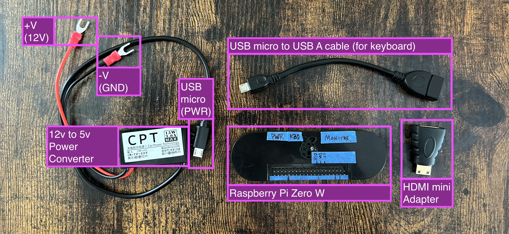
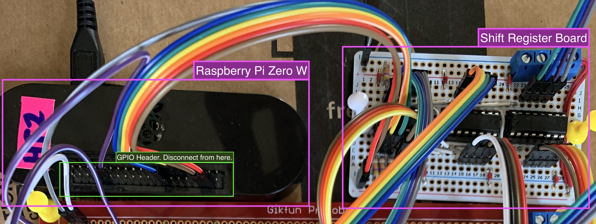
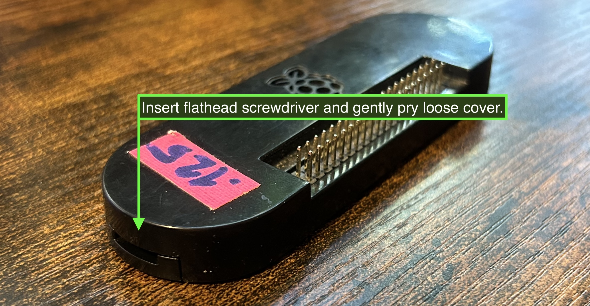
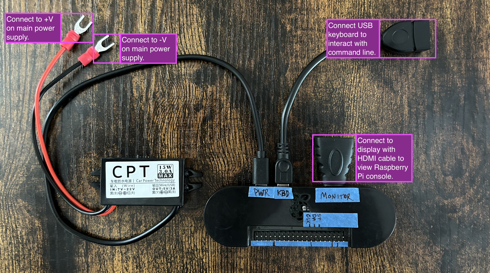
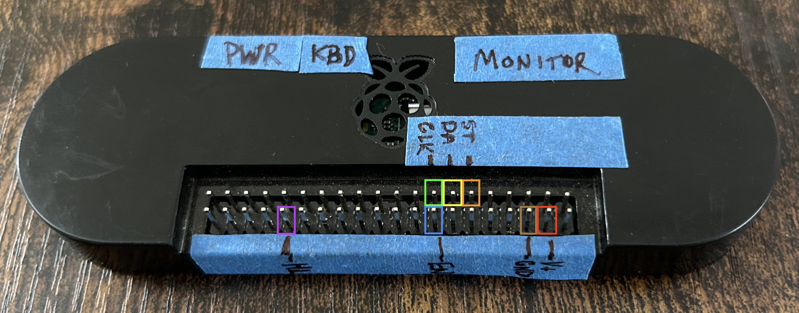
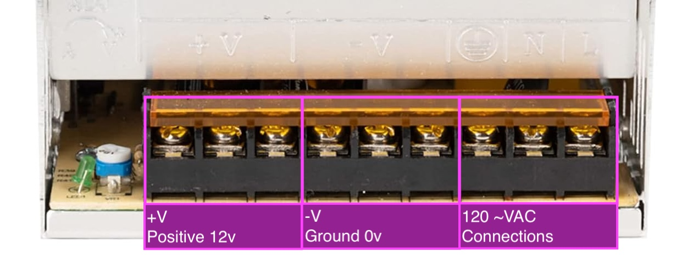

# Replacing the Raspberry Pi

## Before Starting

1. Ensure the power switch on the enclosure is in the `OFF` position
2. Disconnect power from the enclosure

### Tools

* Screwdriver set
* Multi-meter
* Small zip-ties
* Cutting tool for zip-ties
* USB keyboard
* HDMI display device

## What's in the box?



* DC Voltage converter with micro USB connection to Raspberry Pi and fork connection to 12V supply.
* Raspberry Pi Zero W
* USB micro to USB A cable for connecting USB keyboard
* HDMI mini to HDMI adapter to connect a display device
* Return shipping label for anything removed during the replacement process

## Removal Process

### Note:

Please reserve anything you disconnect and do not reconnect in subsequent steps. The following items should be returned to Phillip Stearns using the box that the replacement arrived in and the return shipping label enclosed.

### Disconnect from power supply

1. Locate the set of `BLACK` and `RED` wires connecting the Raspberry Pi to the power supply.
2. Loosen the screws securing those connections on the power supply.
3. Gently remove those connectors.


### Disconnect from Shift Register Board



* The Raspberry Pi is connected to a smaller `shift register` board via jumper wires on its GPIO pins.
* Remove the jumper wires from the `Raspberry Pi GPIO pins`
* **Take down notes of the color jumper wire and attached pin GPIO or header number where appropriate**.
* Please use [this pin out diagram](https://pinout.xyz/) for reference.

Note: Header numbers indicate the actual pin number. GPIO pin number indicates the location on the Broadcom chip (for programming purposes).

**Expected Connections:**

```
WIRE COLOR  PIN     FUNCTION
----------  --------  --------
RED     HEADER 4  +5v
BROWN   HEADER 6  Ground
ORANGE    GPIO 17   Strobe
YELLOW    GPIO 27   Data
GREEN   GPIO 22   Clock
BLUE    GPIO 23   Enable
VIOLET    GPIO 12   Headlights (PWM)
```

### Remove the Raspberry Pi 



1. Pry loose the top cover.
2. Remove the exposed screws.
3. Remove the Raspberry Pi.

## Replacement Process



The image above shows how the different parts included in the replacement kit work together. The keyboard and monitor connections are shown in the event that additional troubleshooting or configuration needs to be done.

### Replace the Raspberry Pi 

1. Remove the cover from the replacement Raspberry Pi.
2. Position the replacement Raspberry Pi and screw into place.
2. Replace the cover.

### Reconnect GPIO wires



1. Reconnect the jumper wires according to the colors in the diagram above.
2. Refer to the connection chart in the removal section above as well as the pin out diagram linked in that same section.

### Connect Voltage Converter



Note: Do not alter `120 ~VAC` connections

1. Screw the Voltage Converter's `RED` wire to any of the three `+V` terminals on the 12V DC power supply.
2. Screw the Voltage Converter's `BLACK` wire to any of the three `-V` terminals on the 12V DC power supply.
3. Connect the Voltage Converter's micro USB connector to the `PWR` port on the Raspberry Pi

## Powering Up

1. Double check connections
2. Reconnect power to the enclosure
3. Turn the switch on the enclosure `ON`

After about a minute, the installation should be running normally. If not, further troubleshooting will need to be performed off site.

## Additional Configuration

If any additional configuration needs to be performed, connect to the Raspberry Pi Zero W directly via USB keyboard and HDMI monitor.

This is also a good way to test whether the Raspberry Pi is in fact booting up properly and working as expected.

### Logging In

```
user: heads-tails
password: Heads I Win!
network name: heads-tails.local
```

1. Power off the installation.
2. Connect a USB keyboard and HDMI display to the Raspberry Pi using the supplied adapters.
3. Power on the installation.
4. You should see a boot sequence and then asked to log in.
5. Type `heads-tails` and press enter
6. Then type `Heads I Win!` and press enter
7. You should now have a command line prompt.

<a id="wifi"></a>
### Configure to connect to WiFi

This should synchronize the installation to local time via the internet once completed. This process will be necessary for any updates to software and local network access without the need for keyboard and monitor (headless) via `ssh`

1. Enter `sudo raspi-config`.
2. Select `1 System Options` and press enter.
3. Select `S1 Wireless LAN` and press enter.
4. Type the **name** (SSID) of the network you wish to connect to and press enter.
5. Type the **password** for the network you wish to connect to and press enter.
6. Select `<Finish>`.
7. Enter `sudo reboot` and wait for the system to reboot.

### To Test Network Connection:

1. Log in following the instructions above
2. Enter `ping google.com -c 5`
3. You should see this:

```
% ping google.com -c 5
PING google.com (142.250.190.78): 56 data bytes
64 bytes from 142.250.190.78: icmp_seq=0 ttl=56 time=73.518 ms
64 bytes from 142.250.190.78: icmp_seq=1 ttl=56 time=63.655 ms
64 bytes from 142.250.190.78: icmp_seq=2 ttl=56 time=67.457 ms
64 bytes from 142.250.190.78: icmp_seq=3 ttl=56 time=74.880 ms
64 bytes from 142.250.190.78: icmp_seq=4 ttl=56 time=134.121 ms
```

### SSH

These instructions presume that the above WiFi connection and are intended to allow access to the raspberry pi locally from another device on the same network. These instructions presume that you're using a Mac or Linux device to connect.

1. Make sure that your device is connected to the same network as the raspberry pi.
2. Use the terminal application to run `ping heads-tails-colgin.local -c 5`
3. If successful, run `ssh heads-tails@heads-tails-colgin.local`
4. Enter the password `Heads I Win!`

### Running the `test.py`:

This script will turn on the `taillight LEDS` one at a time in sequence and gradually brighten and then dim the `headlight LEDs`.

1. run `sudo systemctl stop heads-tails-lite.service` to stop the program
2. run `cd heads-tails-lite`
3. run `python3 test.py` and observe the LEDs to confirm functionality/identify problems
4. press `ctl+c` to stop the script
5. run `sudo systemctl start heads-tails.service` to resume the program

### Syncronizing Time

* [How to Use the `timedatectl` Command on Linux](https://www.howtogeek.com/782032/how-to-use-the-timedatectl-command-on-linux/)
* [Manual for `timedatectl`](https://www.man7.org/linux/man-pages/man1/timedatectl.1.html)