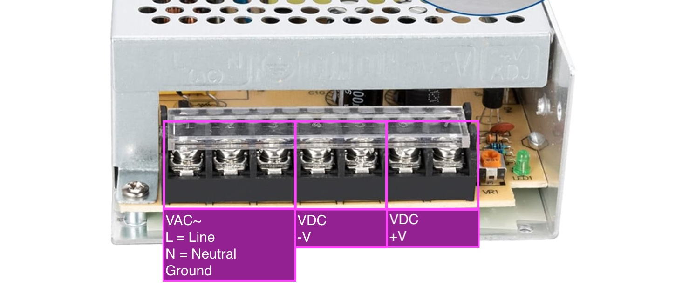
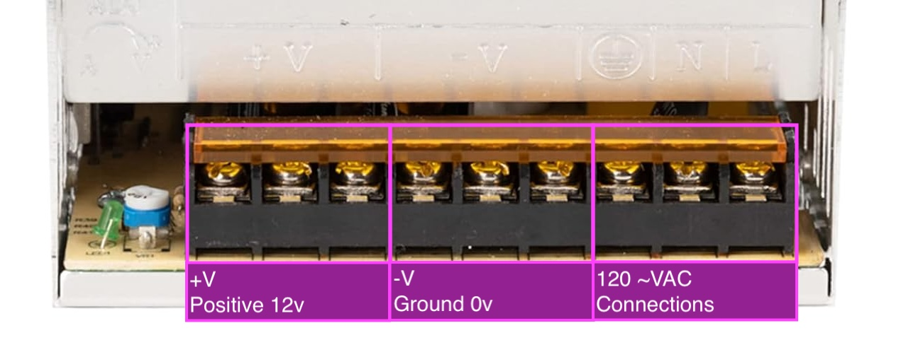
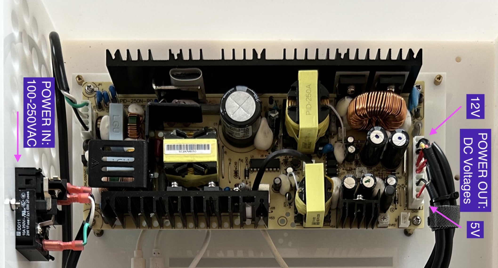
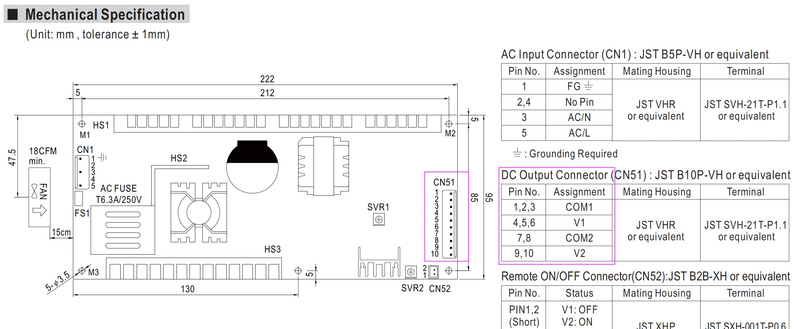

# Power Diagnostic

This guide was made to trace any potential failures in the power supply and related connections to internal components.

**WARNING** The process should be carried out by a person with expert electronics experience, who is able to safely test and service ~120VAC line voltage systems.

## Tools

* Multimeter able to measure continuity, ~VAC and VDC
* Phillips head screwdriver
* Masking tape and marker for labeling cables

## Steps

### Overview

The following steps will check the following points:

* The power cable
* The wall outlet
* The power inlet fuse
* Power supply output

### Power Cable

1. Make sure the switch on the power inlet is off
1. Disconnect the power cable from the wall and inlet on the box
1. Use the multimeter's continuity check to test the Line, Neutral and Ground connections on the power cable

If the cable is bad or questionable, replace it and continue.

### Wall Outlet

1. Using the multimeter set to ~VAC, test the wall outlet to ensure it's supplying ~120 VAC.

### Power Inlet on Box

1. Remove the fuse from the power inlet on the box.
1. Use the multimeter's continuity check to test the fuse.

If the fuse is bad or questionable, replace it and continue.

### Power Supply

#### A. Terminal connectors

If the power supply has terminal block connections, use a Phillips head screwdriver to remove connections from the +V and -V terminals of the power supply. See below for reference:

1. Plug the power cable into the wall and box.
1. Switch ON the box.
1. Test the voltage between the -V and +V connectors. It should read about 12 volts

#### B. Locking header connector

If the power supply has a locking rectangle connector, simply remove the connector from the supply. See below for reference:

Here's a reference of the pin numbers for that connector:

1. Plug the power cable into the wall and box.
1. Switch ON the box.
1. Test the voltage between PIN 1 (COM/GND/-V) and PINS 4,5,6. Each pin should measure about 12 volts.
1. Test the voltage between PIN 7 (COM/GND/-V) and PINS 9,10. Each pin should measure about 5 volts.

## Next Steps

If the above process did not turn up anything wrong, power off the box, reconnect the DC voltage wires and proceed with the Pi Replacement.

If the power supply is found to be faulty, search for the power supply part numbers or replace with power supplies with the same specs.
